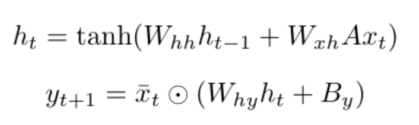

## Introduction

[\#icebucketchallenge](https://en.wikipedia.org/wiki/Ice_Bucket_Challenge) was the hashtag to promote awareness of the ALS disease. Even though [the origin of the movement](https://en.wikipedia.org/wiki/Ice_Bucket_Challenge#Origins) is not clear, it went viral; meaning that so many users in twitter network start using it. There were so many other movements/idea/behaviors  like [\#metoo](https://en.wikipedia.org/wiki/Me_Too_movement), [\#ferguson](https://en.wikipedia.org/wiki/Ferguson_unrest), ... that went viral too, and so many of them were not ([\#GazaUnderAttack](https://en.wikipedia.org/wiki/Media_coverage_of_the_2014_Israel%E2%80%93Gaza_conflict)). Modeling and studying **Information Cascade** in social network is a hard problem, which most of traditional models like *Threshold Cascade Model* or *Independent  Cascade Model* [are not successful](http://www.theoryofcomputing.org/articles/v011a004/v011a004.pdf) on modeling them. If we could capture in what situations users of the network start spreading some information, it would have so many use cases. Specifically in marketing, for influence maximization problem. In this project, I want to use Deep Learning to see the amount of predictability of users' actions in a given network. If the actions are predictable enough, it is a sign that we can propose a good model of human behavior. For proposing the behavioral model, I want to study parameters of the trained model to see what makes some information spread viral in the network, while others die out after short time. 

      
    

This project is [Tensorflow](https://www.tensorflow.org/) implementation of **CascacdeRNN** model. The **CascadeRNN** model is the model inspired by my latest paper ("Friendship Paradox Screws Perception of Popularity", under review). I took *Deep Learning course* to learn basic concepts of Neural Network and becoming familiar with TensorFlow to be able to implement my idea of using Deep Learning for understanding and modeling human behavior in social networks. So far I've fully implemented the model and got good results on a benchmark dataset. As a future work, I want to analyze what is going on inside the learned network and study more complicated datasets. 

## Problem Formulation 

I aim to study the task of information cascade forecasting, which tries to estimate which node is going to be activated next based on history of cascade and network structure. We need two terminologies for defining the problem: 
* **Adjacency Matrix**: Consider a undirected network G = (V, E), with {V} nodes and {E} links. A link (u, v) indicates that *u* and *v* are friends. Let's define the number of nodes of graph G as n = |V|. We can define *n* by *n* binary matrix A, as adjacency matrix of G, where A(i, j) shows whether *i* and *j* are friends or not. 

* **Cascade Sequence**: A cascade sequence is an ordered sequence of nodes s = {v1, v2, ..., vT}, where each v is a distinct node in V. 

Given adjacency matrix A, and training set of cascade sequences S, the goal is to learn parameters of model M to make the output as accurate as possible. As a problem output, I want to propose M, which is able to predict a node to activate at time t, given test cascade sequence s' = { v'1, v'2, ..., v'(t - 1)}.

## Model 
I want to consider some properties to propose a *comprehensive* model, which can capture all differences in different networks as well as users: 
1. **Activeness**: Some users are more active than other users. 
2. **Friendship**: Not all friends have same amount of influence on a user. For example, it is more likely to use a hashtag used by user who I have more mutual friends with rather than a random friend. 
3. **Interest**: Some users are more interested in particular topics. For example, a user is more likely to retweet a political tweet than a meme. 

Considering these factors arises difficulty in modeling cascades. Since the final goal of my research is to propose a model for human behavior, I find RNN appropriate for this purpose. The **CascadeRNN** model is the following: 

    

The input `x_t` is a binary vector with size *N*, where i-th index shows whether user `i` is active at iteration `t` or not. Last hidden state, `h_t`, is a vector with size *H*. Next hidden state and logits formula is as follow:

    

Some intuition behind the update process: 
* Adjacency matrix A times x, would be a vector with size *N* which counts the number of active **friends** for each individual. 
* Multiplying `Ax` to `W_xh` would capture the effect of what each individual **see** in their neighborhood to hidden state. 
* `W_hh` will capture the effect of last hidden state (state of the network so far) on next hidden state. 
* Bias term `B_y` would capture the level of **activeness** of each individual. 
* `W_hy` would capture the effect of state of the network on each individual separately. 
* Elementwise multiplication of `~ x_t` to output vector, will zero-out output for individuals who are already active, and only keeps the non-active individuals who could become active. 

The final output of the model is vector with size *N*, where i-th index is probability of becoming active for node `i`. So, the probability of becoming active for node `v`, given cascade sequence would be the following: 

    

The loss for each individual cascade sequence would be log-likelihood function over time: 

    

The final loss of the model would be loss over all the cascades: 

    

In the literature ([TopoLSTM](https://arxiv.org/pdf/1711.10162.pdf)), they have used HIT and MAP as their evaluation metric. I have used HIT because I found it more intuitive. Hit@10 is the number of successfully having target node in top-10 nodes with highest probability: 

    

## Implementation
You can run the code by running `python src/train.py`. You can use flags to work with hyper parameters and run the code on different datasets. The flags are as follow (the default value is in parentheses). 

* `--dataname (twitter)`
* `--learning_rate (0.01)`
* `--regularization_scale (0.001)`
* `--epochs (50)`
* `--batch_size (64)`
* `--hidden_dim (100)`
* `--max_steps (30)`
* `--early_stopping (10)`

The input must be sub-folder inside `datasets/` folder, and it must contain three `.txt` files: 
* `graph.txt`: each line represents an edge in this file. 
* `train.txt`: each line represents a cascade, which is sequence of user ID and seconds passed to retweet by this user after first tweets.
*  `test.txt`: same as train, but cascades for test.

I've put `twitter` dataset inside the dataset folder for your test. I've download dataset from [TopoLSTM repository](https://github.com/vwz/topolstm).

## Results 
I've used twitter benchmark dataset for evaluation of the model. The information about dataset is as follow:

\# of nodes | \# of edges | \# of cascades | Avg. cascade size
------------|-------------|----------------|------------------
6126 | 8528 | 569 | 14.12

The last row of the following table is results of my model. The rest of the results are grabbed from [TopoLSTM](https://arxiv.org/pdf/1711.10162.pdf) paper. In compare with other methods, the results of **CascadeRNN** is close to TopoLSTM and Embedded-IC. 

Model | Hit@10 | Hit@50 | Hit@100
---------|--------|-------|-------
IC-SB | 22.151 | 31.242 | 32.266 
DeepWalk | 24.721 | 30.730 | 22.266
Embedded-IC | 25.134 | 33.493 | 36.597 
DeepCas | 25.661 | 31.190 | 33.173 
Topo-LSTM | 28.279 | 33.152 | 34.897
**CascadeRNN** | 27.76 | 32.95 | 35.28

The idea of TopoLSTM is similar to mine, but there are two major difference. 
1. The usage of gates in TopoLSTM paper makes the model much more complex that interpreting the results of the model is not trivial. While in CascadeRNN, much of the effort for analysis part would be on three weight matrix `W_hh, W_xh, W_hy` and bias term `B_y`, which has a simple intuition. 
2. The input to TopoLSTM model is a DAG(Directed Acyclic Graph) instead of set of active users in my model. Their goal is to capture structure of the cascade as well as time of becoming active for each user. So, the input size and time complexity of making input is higher in TopoLSTM in compare with CascadeRNN. CascadeRNN captures the structure of the network by multiplying adjacency matrix `A` to set of active users. However, CascadeRNN does not consider time of becoming active for each individual user. I can fix this by using attention-based techniques. 

I was not hopeful on getting comparable results with TopoLSTM when I found the TopoLSTM paper two days before mid-report deadline. But it was really surprising for me that even though I'm loosing less information from data in compare with TopoLSTM, I'm not loosing that much HIT. So it means that probably for each individual, the **sequence** of active friends does not play important rule in their decision on becoming active or not, however, the **set** of active friends play the sufficient amount of rule on their decision. 

## Future Work
1. As I mentioned in [Intoroduction](https://github.com/ninoch/CascadeRNN/blob/master/README.md#introduction), my main goal of doing this kind of research was *not* cascade forecasting. What I really want to do is to understand human behavior and propose behavioral model. So, my main next step would be analyzing weights of my model, using matrix factorization.
2. Currently h0 is always zero for all inputs. I want to make it as output of sentence2vec to capture the content of the tweet. The goal of doing this is to consider **Interest** of users, as I mentioned in [model](https://github.com/ninoch/CascadeRNN/blob/master/README.md#model) section. The other two features (**Activeness** and **Friendship**) are already satisfy by my model. 
3. I want to take a new step on forecasting, and instead of considering diffusion of *one* tweet, I want to consider diffusion of all tweets with same hashtag. These tweets are talking about same thing, but with different representations. Specifically, I am much more interested in movement and events hashtags like \#ferguson, \#icebucketchallenge, \#tcot, \#sxsw, and not regular hashtags. 

## Related Papers
* [IC-SB](http://staff.icar.cnr.it/manco/Teaching/sn/seminari/GBL10.pdf)
* [DeepWalk](https://arxiv.org/abs/1403.6652)
* [Embedded-IC](https://dl.acm.org/citation.cfm?id=2835817)
* [DeepCas](https://arxiv.org/abs/1611.05373)
* [TopoLSTM](https://arxiv.org/pdf/1711.10162.pdf)

Twitter data is from [The Simple Rules of Social Contagion](https://arxiv.org/abs/1308.5015), and the cleaned data could be downloaded from [TopoLSTM repository](https://github.com/vwz/topolstm). 

## Author 

Nazanin Alipourfard @ninoch
