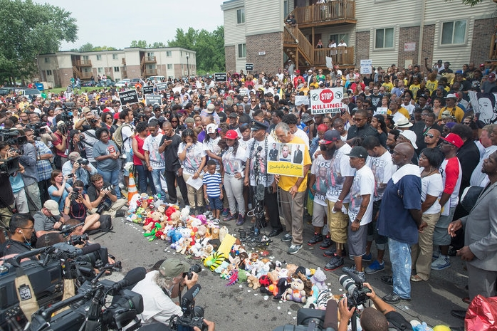

## Introduction

[\#icebucketchallenge](https://en.wikipedia.org/wiki/Ice_Bucket_Challenge) was the hashtag to promote awareness of the disease ALS. Eventough, [the origin of the movement](https://en.wikipedia.org/wiki/Ice_Bucket_Challenge#Origins) is not clear, it went viral; meaning that so many users in twitter network start using it. There were so many other movemenets/idea/behaviours like [\#metoo](https://en.wikipedia.org/wiki/Me_Too_movement), [\#ferguson](https://en.wikipedia.org/wiki/Ferguson_unrest), ... that went viral too, and so many of them were not ([\#GazaUnderAttack](https://en.wikipedia.org/wiki/Media_coverage_of_the_2014_Israel%E2%80%93Gaza_conflict),  ). Modeling and studing **Information Cascade** in social network is a hard problem, which most of traditional models like *Threshold Cascade Model* or *Independet Cascade Model* are not successful on modeling them. If we could capture in what situtations users of the network start spreading some information, it would have so many usecases. Specifically in marketing, for influence maximization problem. In this project, I want to use Deep Learning to see the amount of predicibility of users' actions in a given network. As a future work, I want to study parameters of the trained model to see what makes some information spread viral in the network, while others dies out after short time. 

      
    

This project is [Tensorflow](https://www.tensorflow.org/) implementation of **CascacdeRNN** model. The **CascadeRNN** model is the model inspired by my latest paper ("Friendship Paradox Screws Perception of Popularity", under review). I chose to do the implementation of this model as my Deep Learning course's final project.

## Problem Formulation 

I aim to study the task of information cascade forecasting, which tries to estimate which node is going to be activated next based on history of cascade and network structure. We need two terminologies for defining the problem: 
* **Adjacency Matrix**: Consider a undirected network G = (V, E), with {V} nodes and {E} links. A link (u, v) indicates that *u* and *v* are friends. Let's define the number of nodes of graph G as n = |V|. We can define *n* by *n* binary matrix A, as adjacency matrix of G, where A(i, j) shows whether *i* and *j* are friends or not. 

* **Cascade Sequence**: A cascade sequence is an ordered sequence of nodes s = {v1, v2, ..., vT}, where each v is a distinct node in V. 

Given adjacency matrix A, and training set of cascade sequences S, the goal is to learn parameters of model M to make the output as accurate as possible. As a problem output, I want to propose M, which is able to predict a node to activate at time t, given test cascade sequence s' = { v'1, v'2, ..., v'(t - 1)}.

## Model 
I want to consider some properties to propose a *comprehensive* model, which can capture all differences in different networks as well as users: 
1. **Activeness**: Some users are more active than other users. 
2. **Friendship**: Not all friends have same amount of influence on a user. For example, it is more likely to use a hashtag used by user who I have more mutual friends with rather than a random friend. 
3. **Interest**: Some users are more interested in particular topics. For example, a user is more likely to retweet a political tweet than a meme. 

Considering all of these factors arises difficulty in modeling cascades. 

`x_t` is a binary vector with size *N*, where i-th index shows whether user `i` is active at iteration `t` or not. Last hidden state, `h_t`, is a vector with size *H*. We can get next hidden state and predicted output as follow:

    

Here is some intuition behind the update process: 
* Adjacecny matrix A times x, would be a vector with size *N* which counts the number of active **friends** for each individidual. 
* Multiplying `Ax` to `W_xh` would capture the effect of what each individual **see** in their neighbourhood to hidden state. 
* `W_hh` will capture the effect of last hidden state (state of the network so far) on next hidden state. 
* Bias term `B_y` would capture the level of **activeness** of each individual. 
* `W_hy` would capture the effect of state of the network on each individual sepratly. 
* Elementwise multiplication of `~ x_t` to output vector, will zero-out output for individuals who are already active, and only keeps the non-active individuals who could become active. 

Then, the probability of becoming active for node `v`, given cascade sequence would be the following: 

    

The the loss for each cascade sequence sepratly would be log-likelihood function over time: 

    

The final loss of the model would be loss over all the cascades: 

    

In the letrature ([TopoLSTM](https://arxiv.org/pdf/1711.10162.pdf)), they have used HIT and MAP as their evaluation metric. I have used HIT because I found it more intuitive. Hit@10 is the number of succesffully having target node in top-10 nodes with highest probability: 

    

## Resuls 

## Related Papers

## Author 

Nazanin Alipourfard @ninoch
